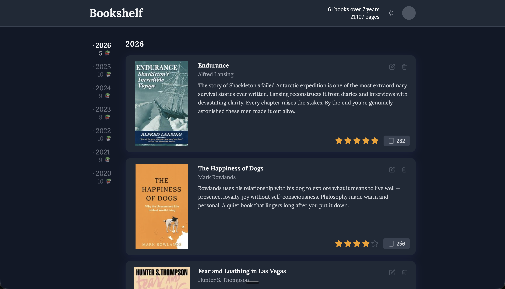
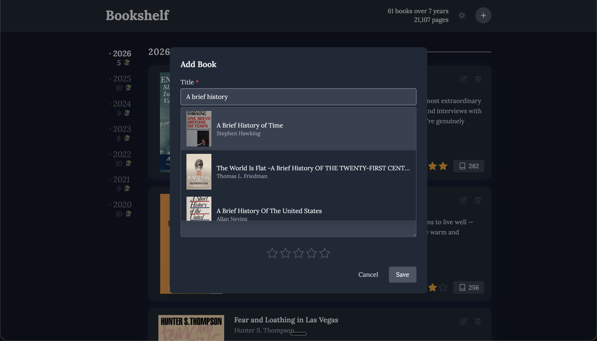
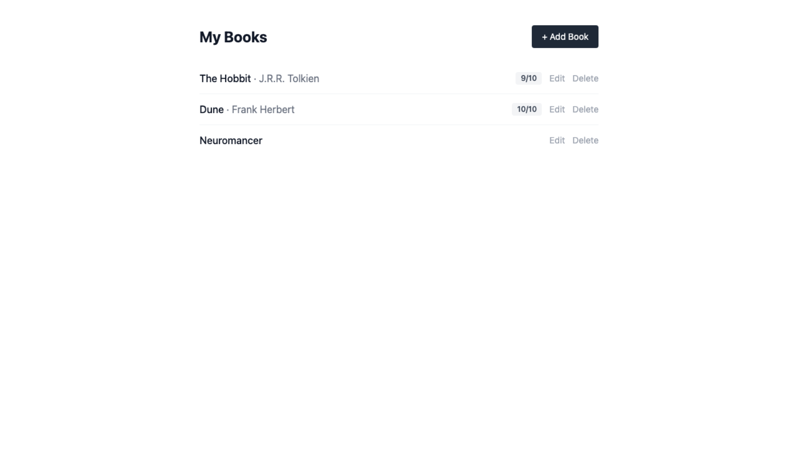
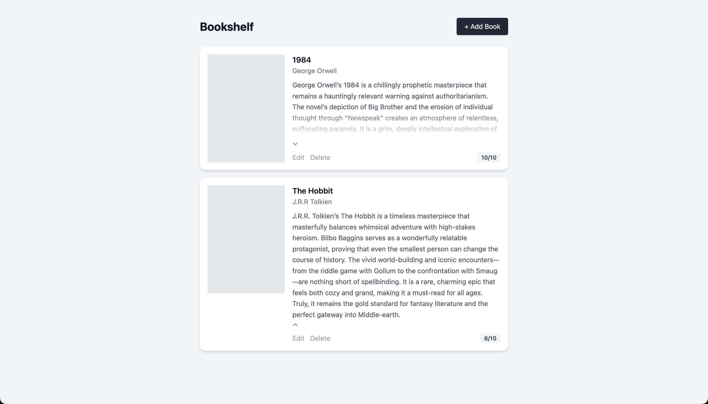
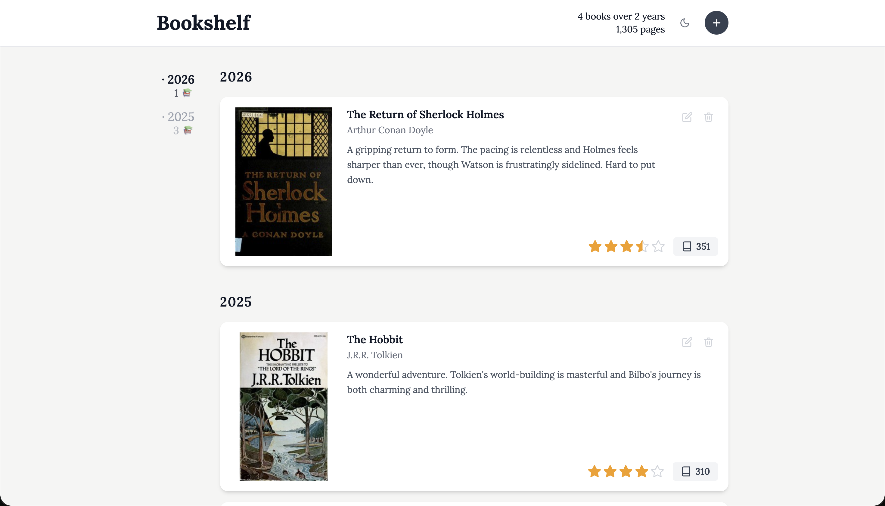

# 📚 Bookshelf [](https://github.com/acarroll117/bookshelf/actions/workflows/ci.yml)

A personal reading tracker built to replace a long-running notes file of books and reviews. The project started as a way to explore full-stack development, AI-assisted development workflows, and how modern tooling could be applied to something I actually use. The longer goal is an augmented bookshelf: AI-driven reading insights, pattern analysis across your reviews, and eventually a visual shelf of every book you have read whether it be e-book or physical.

## Screenshots

<table>
  <tr>
    <td></td>
    <td></td>
  </tr>
  <tr>
    <td colspan="2"><em>Data for illustration purposes only.</em></td>
  </tr>
</table>

## Progression

<table>
  <tr>
    <td></td>
    <td></td>
    <td></td>
  </tr>
</table>

## Features

- **Log every book you finish:** title, author, a full review and a personal rating
- **Half-star ratings:** from 0.5 to 5.0, so you can actually distinguish a 3.5 from a 4
- **OpenLibrary API integration:** start typing a title and book metadata (author, cover, page count) is fetched and filled in automatically
- **Reading stats:** see your total books, years of reading, and pages read at a glance
- **Organised by year:** with a sidebar that lets you jump straight to any year in your history
- **Reviews that don't crowd the card:** long reviews collapse gracefully and expand on click
- **Dark mode:** of course

## Tech Stack

| Layer    | Technology                        |
|----------|-----------------------------------|
| Frontend | React (TypeScript), Tailwind CSS  |
| Backend  | FastAPI (Python)                  |
| Database | PostgreSQL                        |
| Testing  | Playwright (TypeScript)           |

## Getting Started

**Prerequisites:** Python 3, Node.js 18+, PostgreSQL running locally

1. Install dependencies and create the dev database:
   ```bash
   make init
   ```

2. Start both servers in separate terminals:
   ```bash
   make dev-backend   # API on :8000
   make dev-frontend  # UI on :5173
   ```

3. Open **http://localhost:5173** and start adding books!

Database tables are created automatically on first backend startup. Interactive API docs are available at `http://localhost:8000/docs`.

If your local Postgres uses a non-default user or password, edit `backend/.env` before starting the backend.

## Testing

Set up the test database and install Playwright (first time only):
```bash
make install-tests
```

Then run the tests:
```bash
make test       # All tests
make test-api   # API tests only
make test-ui    # UI tests only
```

Tests run against a separate `bookshelf_test` database on dedicated ports (:8001 for the backend, :5174 for the frontend), so they are safe to run alongside a live dev environment.

The UI suite includes automated accessibility checks using [axe-core](https://github.com/dequelabs/axe-core) against the WCAG 2.1 AA standard. Pages are checked in both light and dark mode.

## Development

Run `make help` for a full list of available commands.
